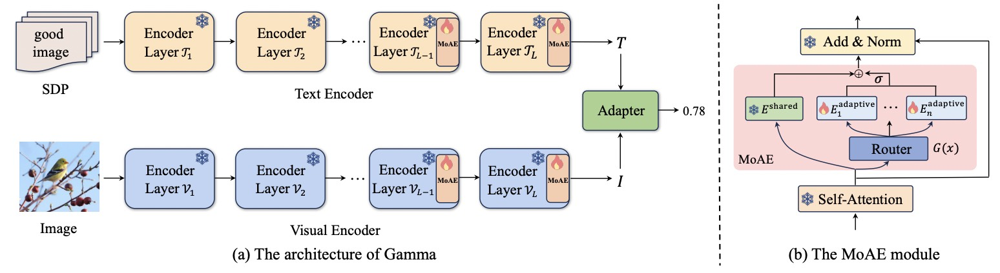
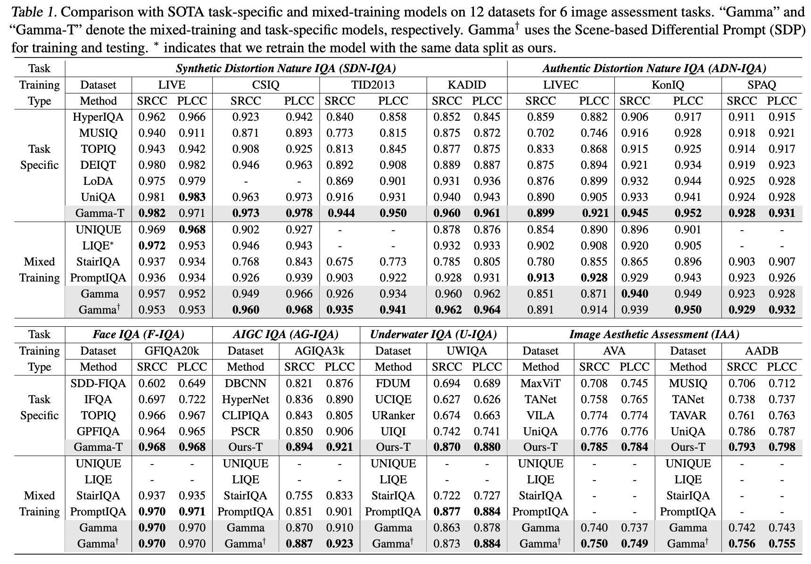
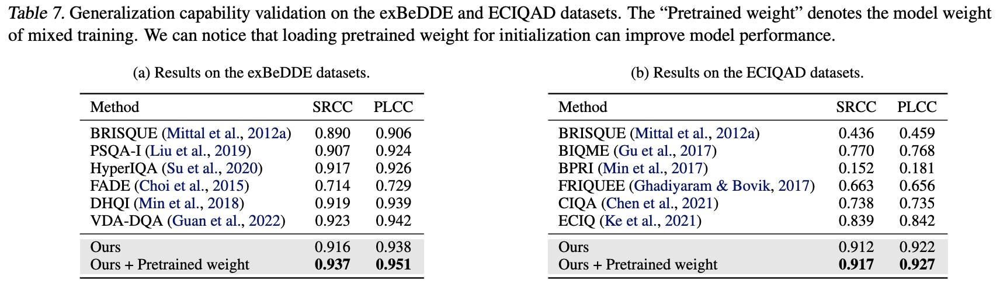
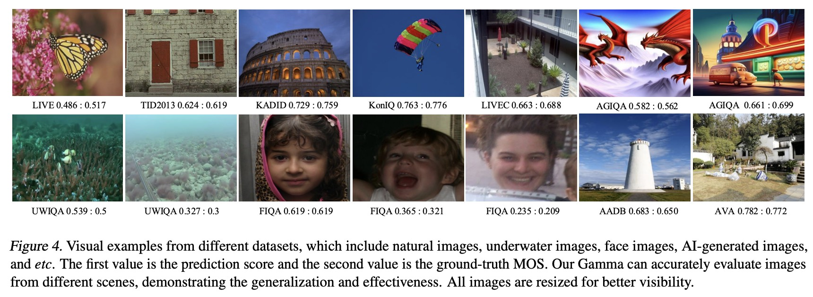

# Gamma: Toward Generic Image Assessment with Mixture of Assessment Experts

## :loudspeaker: Abstract

Image assessment aims to evaluate the quality and aesthetics of images and has been applied across various scenarios, such as natural and AIGC scenes. Existing methods mostly address these sub-tasks or scenes individually. While some works attempt to develop unified image assessment models, they have struggled to achieve satisfactory performance or cover a broad spectrum of assessment scenarios. In this paper, we present Gamma, a Generic imAge assessMent model using Mixture of Assessment Experts, which can effectively assess images from diverse scenes through mixed-dataset training. Achieving unified training in image assessment presents significant challenges due to annotation biases across different datasets. To address this issue, we first propose a Mixture of Assessment Experts (MoAE) module, which employs shared and adaptive experts to dynamically learn common and specific knowledge for different datasets, respectively. In addition, we introduce a Scene-based Differential Prompt (SDP) strategy, which uses scene-specific prompts to provide prior knowledge and guidance during the learning process, further boosting adaptation for various scenes. Our Gamma model is trained and evaluated on 12 datasets spanning 6 image assessment scenarios. Extensive experiments show that our unified Gamma outperforms other state-of-the-art mixed-training methods by significant margins while covering more scenes.





## Installation

- torch>=1.12
- python=3.9
- `pip install -r requirements.txt`

## :open_file_folder: Weight
We release the UniQA pre-trained weight, multimodal IQA and IAA dataset.  **You may need to log out of your Google account to download them.**


 - Gamma weight: [Google Drive](https://drive.google.com/file/d/1ng3MNZfjWZjYI3mpLdaRI5zoi6Uk6eKB/view?usp=sharing); 
 [BaiduNetDisk](https://pan.baidu.com/s/1FRWJb-rHBtGLoJx6kWwo8Q?pwd=evt8)(code: evt8)

- Gamma-Prompt weight: [Google Drive](https://drive.google.com/file/d/1d5w7l5ZjGkFYea5HKdZ6kJD6nlHChoC7/view?usp=sharing); 
 [BaiduNetDisk](https://pan.baidu.com/s/1BQlaCga4jcvezXShqf6hRA?pwd=rjmn)(code: rjmn)

 - Meta_info: [Google Drive](https://drive.google.com/file/d/1OYuAqGNL6Hh-XscHo0yQTG9JQxS1o0Jp/view?usp=sharing); 
 [BaiduNetDisk](https://pan.baidu.com/s/1jVljaC0Rr0zcZUfEVIvZ4g?pwd=qqxd)(code: qqxd)

## 🚀 Training
More detail please see [IQA-PyTorch](https://github.com/chaofengc/IQA-PyTorch).
```
python train.py -opt options/train/Gamma/unified_train.yml --split_index 1
```

Our model can be found in `pyiqa/archs/gamma_arch.py`

## Usage

Our gamma can be used as a ready-made image evaluation model. Please download the pretrained gamma weight.
```
cd infer_demo
python infer.py
```


## :trophy: Result

Gamma is jointly trained on 12 datasets and then evaluated on each dataset separately. Gamma achieves the best results compared to other mixed-training methods. Gamma even surpasses some task-specific methods. In addition, when Gamma is fine-tuned in a task-specific manner, Gamma-T achieves SOTA results on these 12 datasets.





Moreover, our UniQA can be used as a foundational model for other downstream tasks, e.g., medical image quality
assessment, and can achieve SOTA performance after taskspecific training. 



## 🎡 Visualization

Our Gamma can accurately evaluate images in different scenes.




## 📚  Citation
Please cite our work if you find our work and codes helpful for your research.
```
@article{zhou2024uniqa,
  title={UniQA: Unified Vision-Language Pre-training for Image Quality and Aesthetic Assessment},
  author={Zhou, Hantao and Tang, Longxiang and Yang, Rui and Qin, Guanyi and Zhang, Yan and Hu, Runze and Li, Xiu},
  journal={arXiv preprint arXiv:2406.01069},
  year={2024}
}
```

## Acknowledgement

This project is built upon numerous previous projects. We'd like to thank the contributors of [IQA-PyTorch](https://github.com/chaofengc/IQA-PyTorch) and [UniQA](https://github.com/zht8506/UniQA).